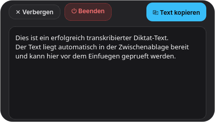

# whisper-pill

> **Minimalistisches, datenschutzfokussiertes Desktop-Diktier-Utility für Linux und Windows – 100 % lokal, quelloffen und kostenlos.**

`whisper-pill` ist eine freie Open-Source-Alternative zu kommerziellen Diktierwerkzeugen wie Whisperbar. Die Anwendung dockt als schlanke, schwebende Kapsel („Pill“) am Bildschirmrand an und wandelt gesprochene Sprache per Tastendruck in präzisen Text um – inklusive automatischer Satzzeichen- und Kommasetzung. Das Transkript wird direkt in die Zwischenablage gelegt und steht sofort zum Einfügen bereit.

---

## 📸 UI-Zustände & Screenshots (Prototyp)

Die schwebende Kapsel behält über alle Zustände hinweg eine **konstante Breite von 420 px** bei. Sie bleibt stabil am oberen Bildschirmrand verankert, springt beim Zustandswechsel nicht und dehnt sich nur beim Öffnen des Editors vertikal nach unten aus.

### 1. Ruhezustand (Idle)
Minimalistisch und unaufdringlich am Bildschirmrand (0 % CPU-Last im Standby):


### 2. Aufnahme (Recording)
Aktiviert per Hotkey oder Klick; visualisiert den Live-Lautstärkepegel via Waveform (`ılılı·|·lılı`) mit sekundenweisem Aufnahme-Timer:


### 3. Fertig & Kopiert (Ready)
CTranslate2 transkribiert die Audiospur blitzschnell auf der CPU und legt das Ergebnis direkt in die System-Zwischenablage:


### 4. Ausgeklappt (Review, Edit & Beenden)
Über `[⤢ Details / Edit]` öffnet sich der Texteditor zur Kontrolle und Nachbearbeitung längerer Diktate:



---

## Highlights

* **100 % Offline & Datenschutz:** Die Spracherkennung läuft vollständig lokal auf deiner CPU via `faster-whisper` (CTranslate2). Keine Cloud-Verbindung, keine API-Kosten, keine Telemetrie.
* **Kein Server-Overhead:** Reine Desktop-Software – kein MCP-Server, kein externer Backend-Zwang, direkte Inferenz im Prozess.
* **Einheitliche Silhouette:** Konstante Kapselbreite (420 px) in allen Zuständen verhindert horizontales Springen.
* **Plattformübergreifend:** Entwickelt für Linux (KDE Plasma 6 Wayland & X11 via nativem D-Bus) und Windows mit freier Positionierung per Drag & Drop.
* **Dual-Clipboard Pipeline:** Natives Wayland-Clipboard via Qt mit automatischem Fallback auf `pyperclip`.
* **Hintergrundbetrieb & Tray:** Minimiert sich in den System-Tray (Taskleiste) und lässt sich jederzeit per Tastenkürzel hervorholen.
* **MIT-Lizenz:** Maximal offen für freie Nutzung, Anpassung und Forks.

---

## Prototyp starten

### Schnellstart im Terminal
```bash
# Vorkonfigurierte virtuelle Umgebung starten
prototype/.venv/bin/python prototype/main.py
```

### Start über Visual Studio Code
Einfach die Datei `prototype/main.py` öffnen und oben rechts auf den **grünen Play-Button** klicken (oder <kbd>F5</kbd> drücken).

---

## Tastenkombinationen & Bedienung

| Funktion | Linux (KDE Plasma 6 / Wayland) | Windows |
|---|---|---|
| **Pill ein- / ausblenden** | <kbd>Super</kbd> + <kbd>Strg</kbd> + <kbd>P</kbd> | <kbd>Win</kbd> + <kbd>Strg</kbd> + <kbd>P</kbd> |
| **Text einfügen** | <kbd>Strg</kbd> + <kbd>V</kbd> | <kbd>Strg</kbd> + <kbd>V</kbd> |
| **Pill verschieben** | Linke Maustaste gedrückt halten & ziehen (Drag & Drop) | Linke Maustaste gedrückt halten & ziehen |
| **Kontextmenü öffnen** | Rechtsklick auf die Pill oder auf das Tray-Icon | Rechtsklick auf die Pill oder auf das Tray-Icon |
| **Beenden** | `[⏻ Beenden]` im Editor, Rechtsklick-Menü oder <kbd>Strg</kbd> + <kbd>C</kbd> | `[⏻ Beenden]` im Editor, Rechtsklick-Menü oder <kbd>Strg</kbd> + <kbd>C</kbd> |

---

## Weiterführende Dokumentation

* **[Technische Entwickler- & Architektur-Dokumentation](docs/architecture/technical_documentation.md):** Klassenmodelle, Mermaid UML-Diagramme, Thread-Architektur und Datenflüsse.
* **[Endbenutzer-Handbuch (Autarkes HTML)](docs/user_guide.html):** Detaillierter Benutzerleitfaden für die tägliche Praxis (100 % offline im Browser nutzbar).
* **[Projekt-Journal](docs/JOURNAL.md):** Chronologisches Log aller Meilensteine, Architektur- und Designentscheidungen.
