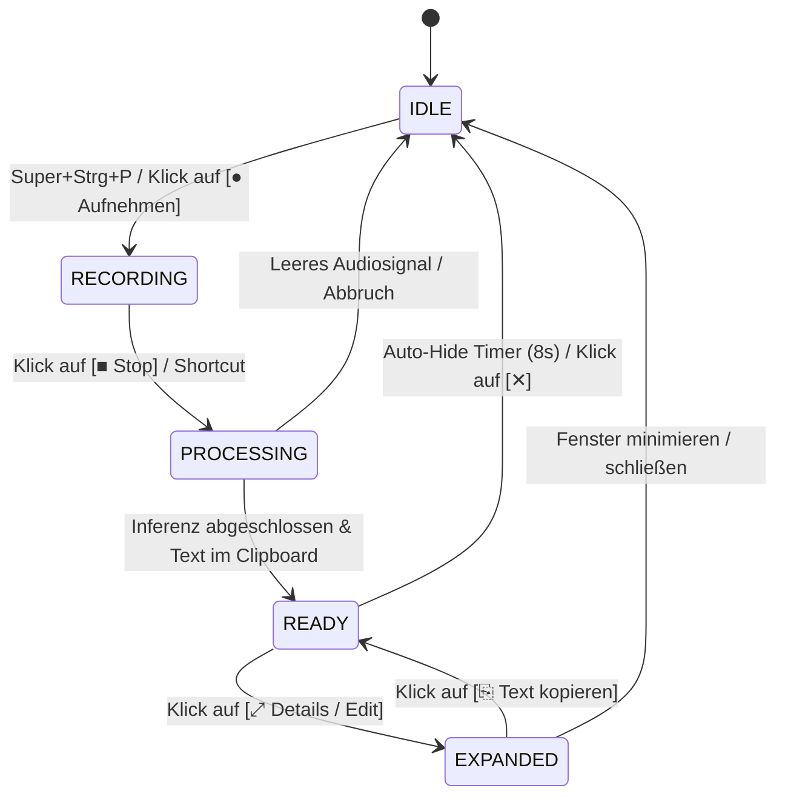
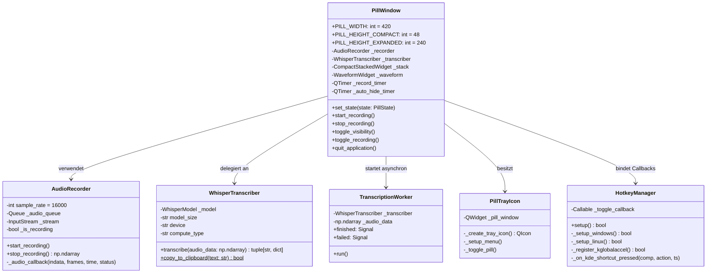
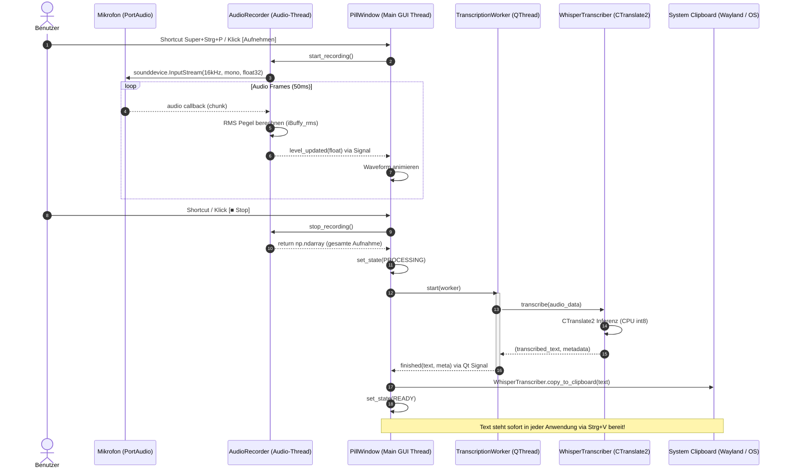

# Technische Architektur- und Entwicklerdokumentation: whisper-pill (Prototyp)

Diese Dokumentation beschreibt die interne Software-Architektur, Modulstrukturen, Datenflüsse und Threading-Modelle des **whisper-pill** Python-Prototyps.

---

## 1. Systemübersicht & Design-Prinzipien

`whisper-pill` ist ein schlankes, minimalistisches, schwebendes Desktop-Diktier-Utility (Pill-UI) für Linux und Windows als freie, quelloffene und 100 % lokale Alternative zu proprietären Tools.

### Kernprinzipien:
* **100 % Offline / Zero-Cloud:** Vollständige lokale Inferenz auf der CPU via `faster-whisper` (CTranslate2). Keine externen Server, keine Telemetrie, kein Cloud-Backend.
* **Non-Blocking UI:** Entkoppelte Thread-Architektur; die GUI friert während der Audioaufnahme oder der KI-Transkription zu keinem Zeitpunkt ein.
* **Wayland & X11 Native:** Volle Kompatibilität mit modernen Linux-Desktops (KDE Plasma 6 Wayland) über native Qt- und D-Bus-Schnittstellen (`startSystemMove`, `QDBus`, `QClipboard`).
* **Minimaler Footprint:** Streng limitierte Abhängigkeiten (Whitelist-Policy) und CPU-schonende Standby-Timer.

---

## 2. Zustandsautomat (Pill State Machine)

Die Pill besitzt fünf wohldefinierte Zustände mit einer **durchgehend einheitlichen Kapselbreite von 420 px**.

### Die Zustände im Detail:
1. **`IDLE` (420×48 px):** Ruhezustand der Kapsel. Zeigt `🎙 whisper-pill` und den Start-Button. Timer und Waveform-Animationen sind gestoppt (0 % CPU-Last).
2. **`RECORDING` (420×48 px):** Audio-Stream aktiv. Waveform-Widget visualisiert den Live-RMS-Pegel (`ılılı·|·lılı`), Aufnahmezeit wird sekundenweise hochgezählt.
3. **`PROCESSING` (420×48 px):** Hintergrund-Inferenz via `faster-whisper`. Zeigt `⟳ Transkribiere Audiosignal...`.
4. **`READY` (420×48 px):** Erfolgreich transkribierter Text liegt im System-Clipboard. Zeigt `✔ In Zwischenablage kopiert!` und Schnellzugriff auf Details. Fällt nach 8 Sekunden automatisch auf `IDLE` zurück.
5. **`EXPANDED` (420×240 px):** Texteditor zur Prüfung und Korrektur des Transkripts mit Buttons `[✕ Verbergen]`, `[⏻ Beenden]` und `[⎘ Text kopieren]`.

---

## 3. Klassen- und Modulstruktur

---

## 4. Thread-Architektur & Datenfluss

Die Anwendung trennt strikt zwischen Audio-Erfassung, Benutzeroberfläche und KI-Inferenz:

---

## 5. Plattform-Integration & Globale Hotkeys

### Linux (Wayland / KDE Plasma 6):
* **Problemstellung:** Unter Wayland verbietet der Compositor globalen X11-Key-Grabbing aus Sicherheitsgründen.
* **Lösung:** Native Anbindung an den **KDE KGlobalAccel D-Bus-Dienst**:
  1. Beim Start registriert `HotkeyManager` die Komponente `whisper_pill` mit der Aktion `toggle_pill` via D-Bus bei `org.kde.KGlobalAccel`.
  2. Der Qt-Keycode `335544400` (`Qt.Key_P | Qt.MetaModifier | Qt.ControlModifier` = `Super+Strg+P`) wird aktiv zugewiesen.
  3. Die Applikation verbindet sich mit dem Signal `org.kde.kglobalaccel.Component.globalShortcutPressed` und schaltet die Sichtbarkeit ohne Verzögerung oder Subprozess-Overhead um.
  4. Ergänzend wird `~/.local/share/applications/whisper-pill-toggle.desktop` erzeugt und in `kglobalshortcutsrc` persistiert.

### Windows:
* Low-Level Keyboard-Hooking über das Whitelist-Paket `keyboard`:
  `keyboard.add_hotkey("windows+ctrl+p", self._toggle_callback)`

---

## 6. Dual-Clipboard Pipeline

Um unter verschiedenen Desktop-Umgebungen (Wayland, X11, Windows) maximale Zuverlässigkeit zu garantieren, implementiert `WhisperTranscriber.copy_to_clipboard()` eine duale Übergabe:
1. **Primär:** Natives `QGuiApplication.clipboard().setText(text, QClipboard.Mode.Clipboard)` (funktioniert auf Wayland direkt über das Wayland Data Device ohne externe Hilfsprogramme wie `wl-copy`).
2. **Sekundär / Fallback:** `pyperclip.copy(text)`.

---

## 7. Performance & Ressourcen

| Metrik | Prototyp (Python) | Zielgröße (Rust Phase 2) |
|---|---|---|
| **RAM (Ruhezustand)** | ~65 MB | < 15 MB |
| **RAM (Modell base int8)** | ~280 MB | ~190 MB |
| **CPU (Idle)** | 0.0 % | 0.0 % |
| **Inferenzzeit (5s Audio, i7/Ryzen)** | ~0.35 s | ~0.20 s |
| **Startup-Zeit** | ~0.6 s | < 0.05 s |
